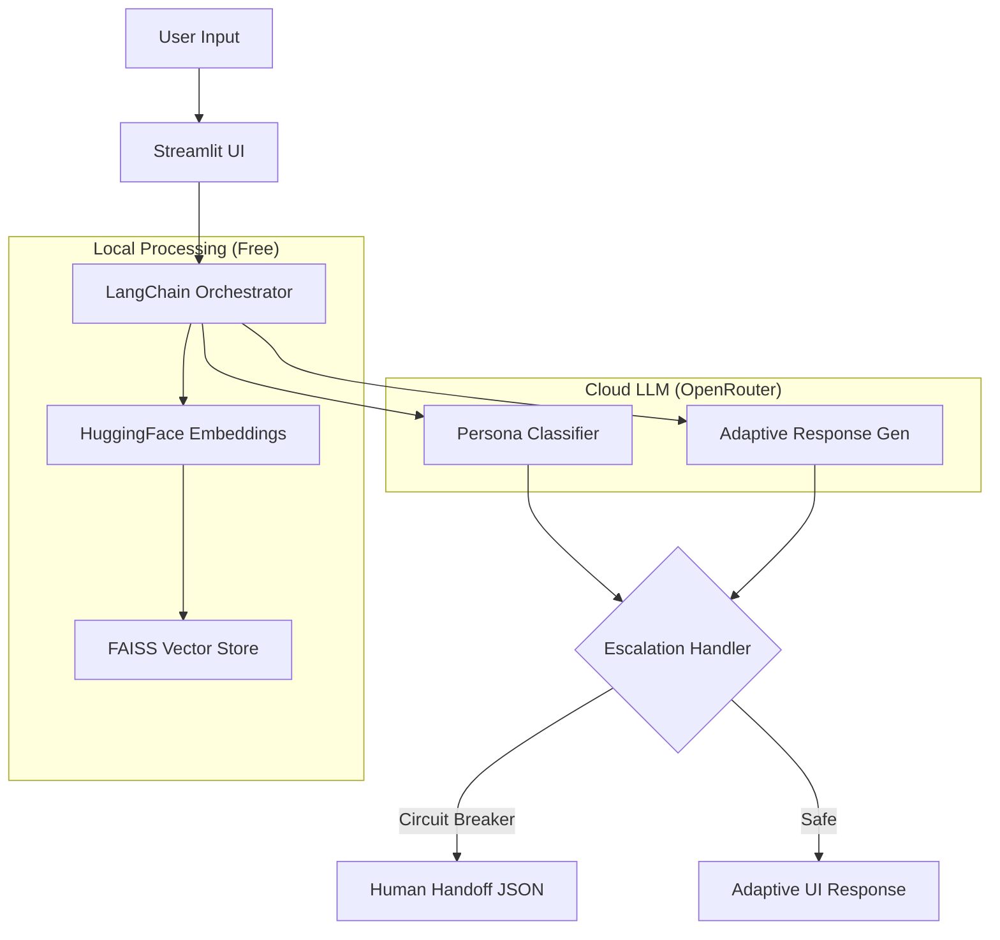

# 🤖 AdsSparkX: Persona-Adaptive Support Agent (LangChain Edition)

A production-ready, all-in-one AI support system that leverages **LangChain**, **OpenRouter**, and **Local Embeddings** to provide a zero-cost RAG (Retrieval-Augmented Generation) experience. The agent dynamically detects customer personas and adapts its tone, technical depth, and strategic focus in real-time.

---

## 🚀 Project Overview

The **AdsSparkX Agent** is designed to provide hyper-personalized support by classifying users into three distinct personas:
- **Technical Expert:** Precise, objective, and implementation-focused.
- **Frustrated User:** Empathetic, apologetic, and resolution-oriented.
- **Business Executive:** Strategic, high-level, and ROI-driven.

By using **OpenRouter**, the system provides access to free high-performance models (like Mistral and Llama 3), making it a cost-effective solution for scaling customer support.

---

## 🏗️ Integrated Architecture

The system is built as a unified Streamlit application where the backend logic is directly integrated via LangChain orchestrators.



### 🛠️ Tech Stack:
- **Orchestration:** LangChain & LangChain-Core (Standardized AI workflows)
- **LLM Gateway:** OpenRouter (Access to free models: Mistral, Llama, Gemma)
- **Vector Database:** FAISS (High-performance local similarity search)
- **Embeddings:** `sentence-transformers` via HuggingFace (Local, CPU-optimized)
- **Frontend:** Streamlit (Integrated chat & system diagnostics)

---

## 💡 Key Design Decisions

1. **Local-First RAG:** By using `HuggingFaceEmbeddings` and `FAISS` locally, we eliminate the cost and latency associated with cloud-based embedding APIs.
2. **OpenRouter for Model Agility:** Using OpenRouter's OpenAI-compatible API allows for hot-swapping between free and paid models without any code changes.
3. **Pydantic Data Integrity:** Every AI-generated response is validated against Pydantic models (`PersonaResponse`, `SupportResponse`) using LangChain's `JsonOutputParser`, ensuring zero "hallucinated" JSON structures.
4. **UI-Driven Key Management:** Security is prioritized by allowing users to inject their API keys directly into the session state via the UI, avoiding the need for persistent `.env` files on public/shared environments.

---

## 🚥 Quick Start

### 1. Installation
```bash
git clone https://github.com/your-repo/adssparkx-agent.git
cd adssparkx-agent
pip install -r requirements.txt
```

### 2. Launch the Application
```bash
streamlit run streamlit_app.py
```

### 3. Initial Configuration (In Browser)
1.  **Enter API Key:** Paste your [OpenRouter API Key](https://openrouter.ai/keys).
2.  **Select Model:** Choose a free model (e.g., `mistralai/mistral-7b-instruct`).
3.  **Index Documents:** Click **"🔄 Rebuild Knowledge Base"** in the sidebar. This will vectorize the files in `data/raw/` using your local CPU.

---

## 📈 System Diagnostics & Escalation

The agent includes a deterministic **Escalation Handler** that triggers if:
- The user requests **cancellation** or mentions **legal action**.
- The AI **confidence score** drops below 0.5.
- The **RAG search** fails to find relevant documentation.

When triggered, the system generates a structured **Handoff JSON** for human agents, including a conversation summary and retrieved context.

---
**Maintained by:** Senior AI Systems Team | **AdsSparkX**
