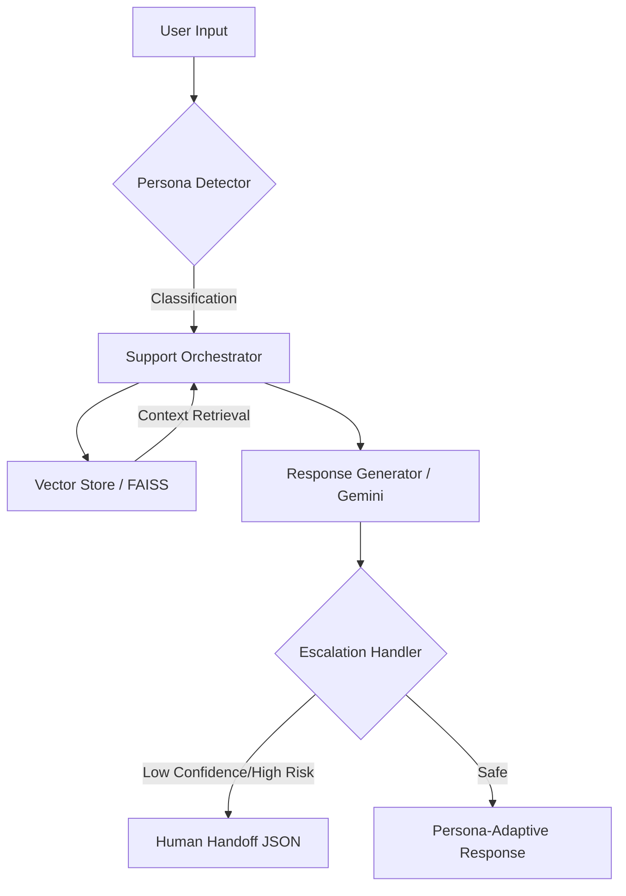

# Persona-Adaptive Customer Support Agent (AdsSparkX)

A production-ready, RAG-driven AI support agent designed to classify customer personas in real-time and dynamically adapt response tone, technical depth, and strategic focus using the Gemini API and FAISS vector search.

---

## 🚀 Project Overview

The **AdsSparkX Support Agent** identifies whether a user is a **Technical Expert**, a **Frustrated User**, or a **Business Executive**, and adjusts its internal "personality" before generating a response. 

### Key Capabilities:
- **Persona Detection:** Real-time behavioral analysis using zero-shot classification.
- **Dynamic RAG:** Context-aware retrieval from a vectorized knowledge base.
- **Tone Adaptation:** Surgical prompt engineering to switch between empathetic, technical, and strategic modes.
- **Safety-First Escalation:** Deterministic circuit-breaking for high-liability scenarios (legal, cancellation, low-confidence).

---

## 🏗️ Architecture

The system follows a **Modular Service-Oriented Architecture** to ensure components can be scaled or swapped independently.



---

## 🛠️ Design Decisions & Rationale

1. **JSON Mode for Inter-Service Communication:** All LLM calls use `response_mime_type: "application/json"`.
2. **Overlap-Based Text Chunking:** Used a 50-character overlap during document ingestion to prevent context loss.
3. **Deterministic Escalation:** Rule-based escalation for legal/cancellation requests.
4. **Confidence Thresholding:** Implemented a 0.7 confidence floor for persona detection.

---

## 🚥 Setup & Installation

1. **Clone the repository:**
   ```bash
   cd persona_support_agent
   ```

2. **Environment Configuration:**
   Create a `.env` file:
   ```env
   GEMINI_API_KEY=your_google_gemini_api_key_here
   ```

3. **Install Dependencies:**
   ```bash
   pip install -r requirements.txt
   ```

4. **Initialize Knowledge Base:**
   ```bash
   python -c "from src.rag.vector_store import VectorStore; VectorStore().build_index()"
   ```

5. **Launch the System:**
   - **Backend:** `uvicorn main:app --reload`
   - **Frontend:** `streamlit run streamlit_app.py`

---

## 📊 Example API Interaction

### Request
`POST /chat`
```json
{
  "message": "How do I implement the batch update API?"
}
```

### Response
```json
{
  "response": "To implement batch updates, use the POST /v1/batch endpoint. You can update up to 1,000 campaigns in a single request.",
  "persona_info": {
    "persona": "Technical Expert",
    "confidence": 0.95
  }
}
```
